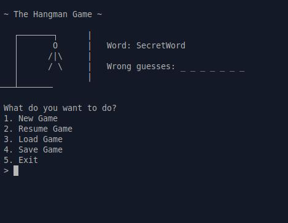

# Hangman Game 🎉

This was a super fun project — more practice working with **classes** and get some hands-on experience with **file handling** in Ruby!

The game includes:

- Word guessing logic 🧠  
- Tracking correct and wrong letters  
- Saving & loading game state with JSON  
- Basic I/O interaction using text files  
- A little bit of ASCII-art fun with hangman drawings 🎨

## Preview

